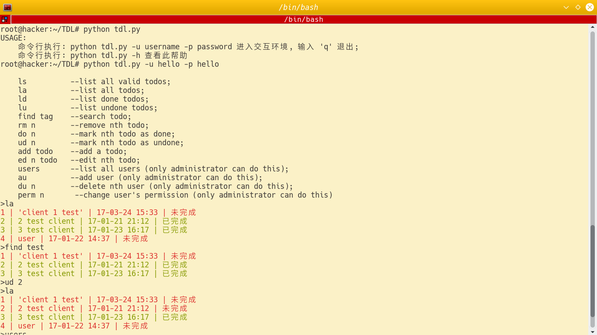
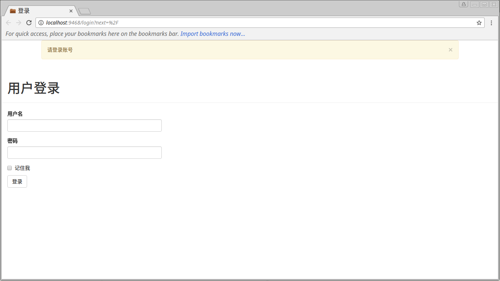
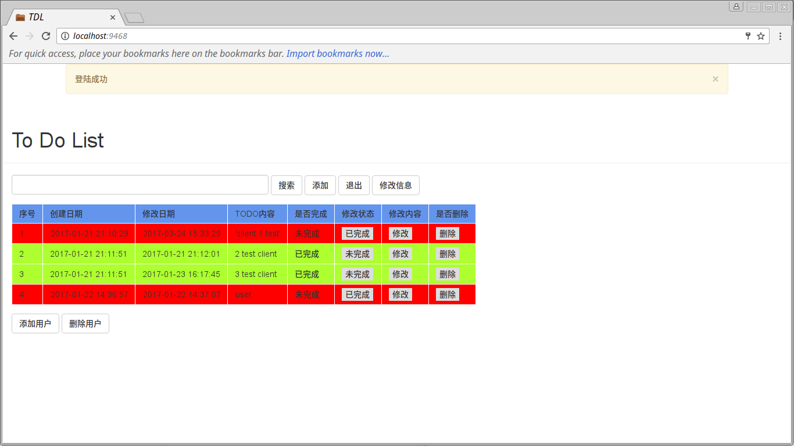
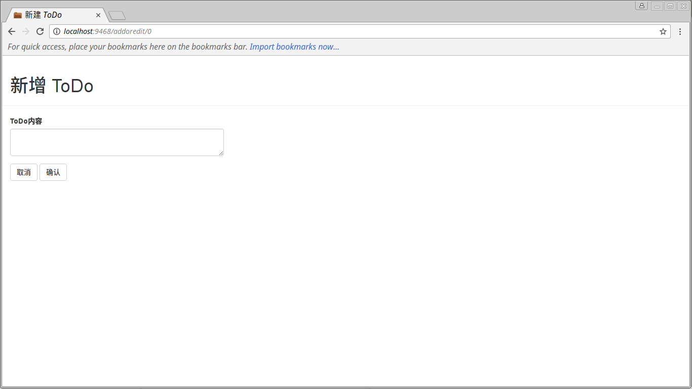
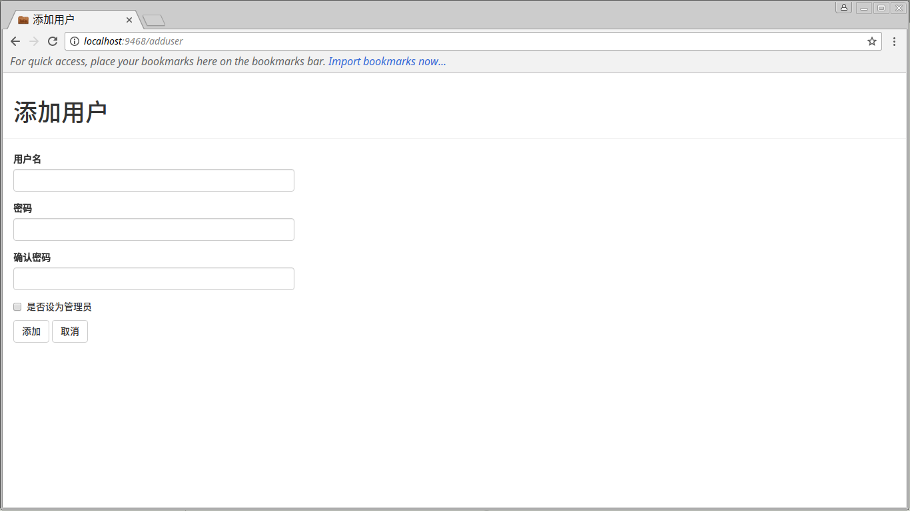
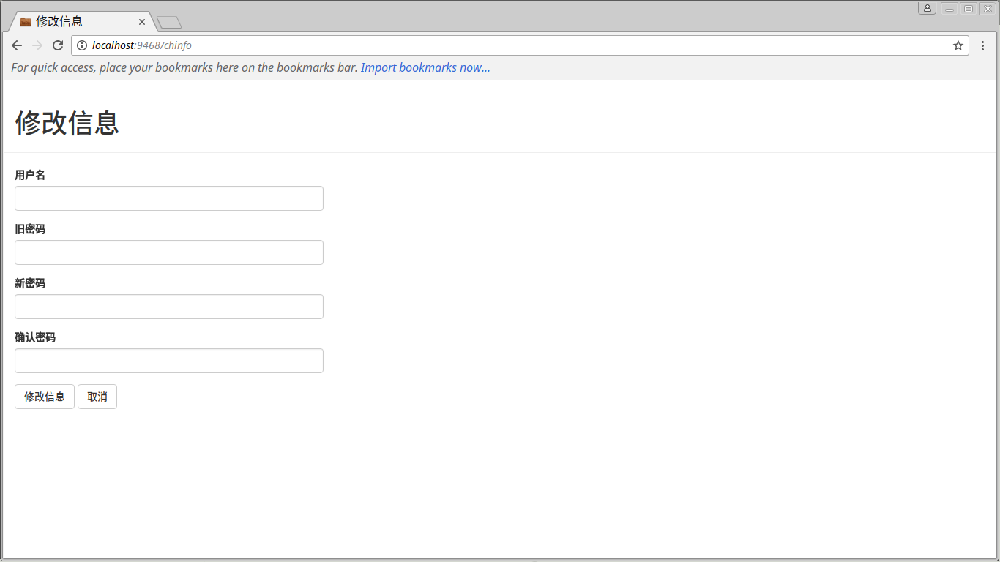
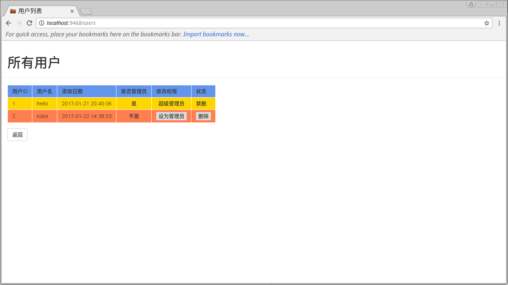

# TDL

#### 简介

TDL — ToDoList 使用 Python Flask 框架开发的一个中文版待做事项列表小应用，包括查看、添加、完成、删除、搜索、用户管理等功能。

这个应用主要是想在 Linux 平台上使用，理论上应该可以在任何装有 Python (version 2) 及相应包的平台上使用，因为本人就一直用 Linux，不能保证 Windows 以及 MacOS 平台是否能正常使用，另外还有一个原因是 Windows 和 MacOS 系统上相应的软件很多，而且这个应用主要以 Web 页面和命令行操作为主，并没有精美的 GUI 界面。

这个应用包括三部分：

- 服务端
- Web 客户端
- 命令行

#### 需要的安装的 Python 包

- flask
- flask_login
- flask_sqlalchemy
- flask_bootstrap
- flask_wtf
- wtforms
- werkzeug
- sqlalchemy
- colorama (可选)

#### 运行及配置

通过 `python run_tdl.py` 启动应用，web 页面访问 [http://localhost:9468](http://localhost:9468)。

第一次启动应用时会创建 $HOME/.tdl/ 目录，该目录包括三个文件:
- README 是说明文件
- tdl.json 是应用的选择配置文件
    ```
    {
    "config_type": "default",
    "host": "localhost",
    "port": 9468
    }
    ```
    - 修改 config_type 的值，默认的 default 为 development ，还可选择 production ;
    - 修改 host 的值;
    - 修改端口 port 的值
- tdl.db 是应用的 SQLite 数据库文件，初始数据:
    - 用户名: admin
    - 密码: admin
    
#### 命令行使用说明

- 命令行执行: `python tdl.py -u username -p password` 进入交互环境, 输入 'q' 退出
- 命令行执行: `python tdl.py -h` 查看帮助
- 可用命令:

    ```
    ls          --list all valid todos;
    la          --list all todos;
    ld          --list done todos;
    lu          --list undone todos;
    find tag    --search todo;
    rm n        --remove nth todo;
    do n        --mark nth todo as done;
    ud n        --mark nth todo as undone;
    add todo    --add a todo;
    ed n todo   --edit nth todo;
    users       --list all users (only administrator can do this);
    au          --add user (only administrator can do this);
    du n        --delete nth user (only administrator can do this);
    perm n      --change user's permission (only administrator can do this)
    ```
- 命令行操作是直接对 $HOME/.tdl/tdl.db 数据库进行操作，不需要启动服务端

#### 运行截图

- 命令行 

- WEB 页面

	1.登录 

	2.首页 

	3.添加修改待做事项 

	4.添加用户 

	5.修改个人信息 

	6.用户管理 
